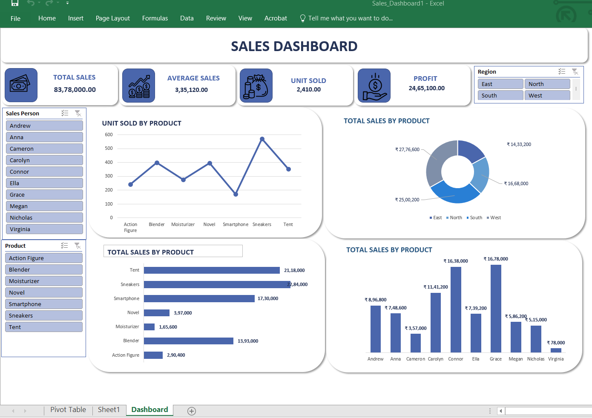

# Sales Dashboard - Excel 📊

## Overview
Interactive Sales Dashboard built using Microsoft Excel
with Pivot Tables, Charts, and Slicers.

## Tools Used
- Microsoft Excel — Dashboard, Pivot Tables, Charts

## Dashboard Features
- Total Sales, Average Sales, Units Sold, Profit — KPI Cards
- Unit Sold by Product — Line Chart
- Total Sales by Product — Bar Chart & Donut Chart
- Total Sales by Salesperson — Column Chart
- Region Filter (East/North/South/West)
- Sales Person Filter
- Product Filter

## Key Insights
- Tent has highest sales (21,18,000)
- Sneakers second highest (22,84,000)
- Grace leads in individual sales (16,78,000)
- West & East regions dominate sales

## Dashboard Preview

